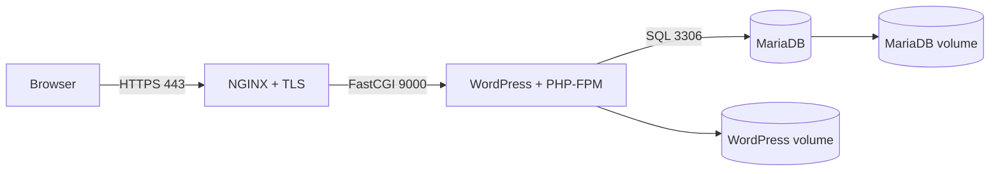
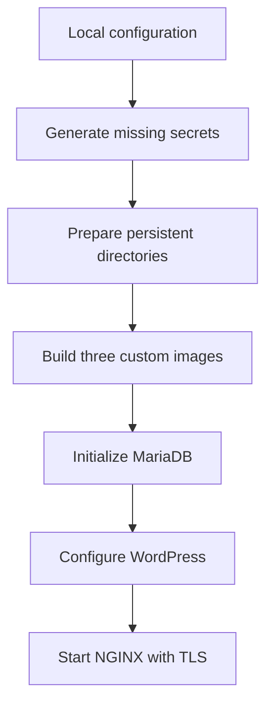

# Inception

[](https://github.com/C1STA/inception/actions/workflows/build.yml)

A containerized WordPress infrastructure built from custom Debian-based images.
The project separates the HTTPS entrypoint, application runtime, and database
into three isolated services orchestrated with Docker Compose.

Inception is a system-administration project from the 42 curriculum. It focuses
on reproducible infrastructure, service boundaries, secret management, TLS, and
persistent data rather than application development.

## Architecture



Only NGINX publishes a host port. WordPress and MariaDB communicate exclusively
through the internal `inception` bridge network.

## Engineering highlights

- Three custom images built from `debian:bookworm`, without using application
  images from Docker Hub
- TLS 1.2 and TLS 1.3 termination at NGINX with a generated local certificate
- WordPress served by PHP-FPM, with no web server in the application container
- MariaDB isolated from the host network
- Passwords generated locally and mounted through Docker secrets
- Idempotent entrypoint scripts that initialize services only when required
- Persistent WordPress and MariaDB data backed by host directories
- `restart: always` policies for recovery after Docker or VM restarts
- No idle shell loops or fake long-running commands: each container executes its
  service as PID 1

## Service lifecycle



MariaDB creates its system tables, application database, and restricted user on
the first start. WordPress waits for the database, creates `wp-config.php`, and
installs the site and users only when needed. Existing volumes are reused on
subsequent starts.

## Run locally

### Requirements

- Linux or a Linux virtual machine
- Docker Engine with Docker Compose v2
- GNU Make and OpenSSL
- Permission to create directories under `$HOME/data`

Create the local configuration files:

```bash
git clone https://github.com/C1STA/inception.git
cd inception
cp srcs/.env.example srcs/.env
cp srcs/local.env.example srcs/local.env
```

Adjust the values if needed, then start the stack:

```bash
make
```

The default configuration uses `inception.local`. Add it to `/etc/hosts`:

```text
127.0.0.1 inception.local
```

Open <https://inception.local> and accept the self-signed development
certificate. The WordPress administration page is available at
<https://inception.local/wp-admin>.

Useful commands:

| Command        | Action                                      |
| -------------- | ------------------------------------------- |
| `make up`      | Build and start the complete stack          |
| `make down`    | Stop and remove the containers              |
| `make stop`    | Stop the containers without removing them   |
| `make start`   | Restart existing containers                 |
| `make ps`      | Display service status                      |
| `make logs`    | Follow logs from all services               |
| `make config`  | Render and validate the Compose model       |
| `make fclean`  | Remove this stack, its volumes, and its data |

Generated passwords are stored under `secrets/` and never committed. The
account names and emails live in the ignored `srcs/local.env` file.

## Validation

Check the HTTPS endpoint:

```bash
curl -k -I https://inception.local
```

Only NGINX should expose a host port:

```bash
make ps
```

The repository's GitHub Actions workflow validates all shell scripts, renders
the Compose model, and builds the three custom images.

## Project structure

```text
.
|-- Makefile
|-- README.md
|-- USER_DOC.md                 Operations and usage guide
|-- DEV_DOC.md                  Architecture and maintenance guide
|-- secrets/                    Generated passwords, ignored by Git
`-- srcs/
    |-- .env.example            Shared non-sensitive configuration
    |-- local.env.example       Local WordPress account template
    |-- docker-compose.yml
    `-- requirements/
        |-- nginx/              TLS entrypoint and FastCGI proxy
        |-- wordpress/          PHP-FPM, WP-CLI, and initialization
        `-- mariadb/            Database configuration and initialization
```

The exact version submitted to 42 is available through the `42-submission` tag.
